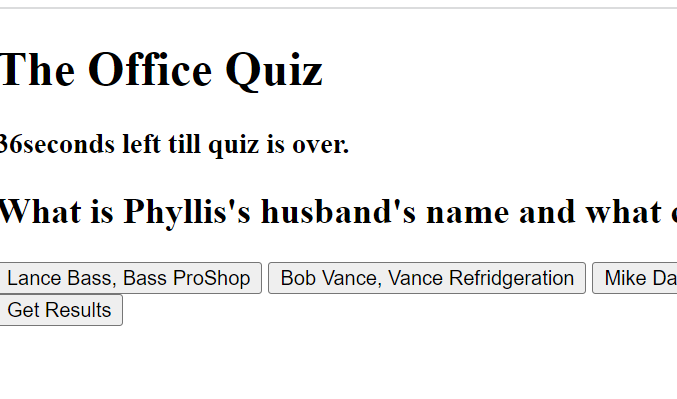
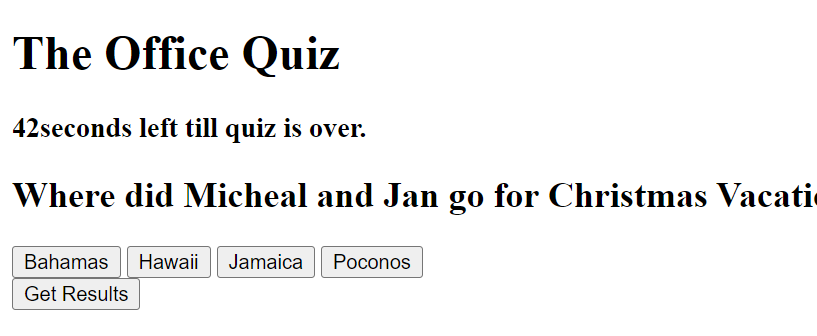

# Code-Quiz2023

## Description

This code-quiz is about the show "The Office". No joke I have watched the whole series a lot. I would give a number, but it would be embarrassing.  I again watched a bunch of videos on youTube, rewatched all the previous cohorts, and finally reached out to a tutor for some help with this one.  For some reason my questions and answers do not match, so any help with that would be very much appreciated. While in class it all works, but once the zoom call ends... Slowly this is all making sense to me. I know in a few weeks I can look back on this homework and fix my mistakes.  I am looking forward to that. I don't think this application solves any problems, other then who is the biggest Office nerd. I need to go back and take a closer look at what functions do and how to call them. I really stumbled on this. I know that's kind of the point when you are not given any starter code. I have now alloted more time to exploring differnt website to see how other people code and get a grasp on that as well.  

## Installation
 N/A unless you havent seen "The Office", then I would recommend binge watching it. Please feel free to contact me and we can discuss it!

 ## Usage 
 
 
 
https://saragar710.github.io/Code-Quiz2023/

## Credits
Stanley and his previous co-horts
Jacob Carver (tutor)
youTube
google

## License
Plese refer to the LICENSE in the repo.